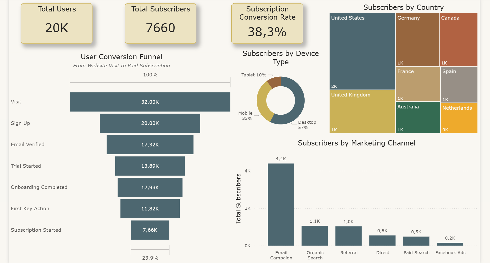
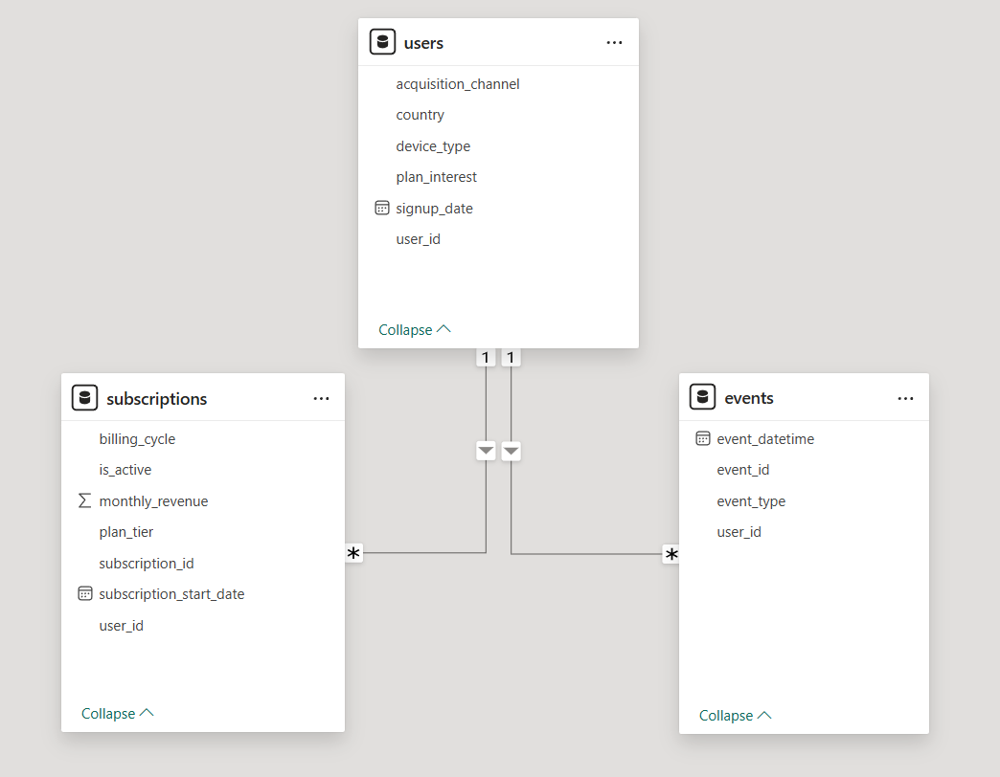
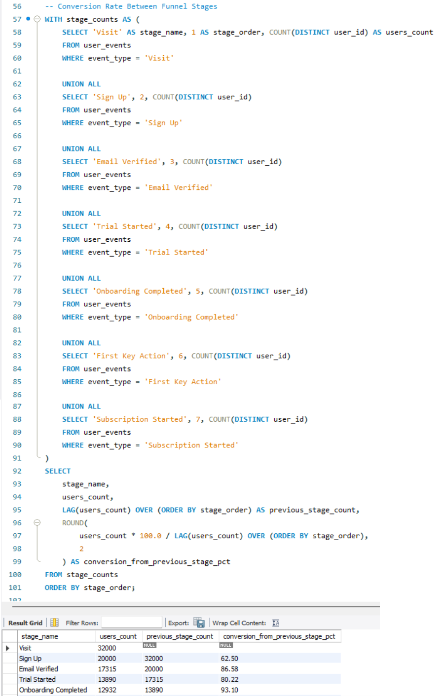
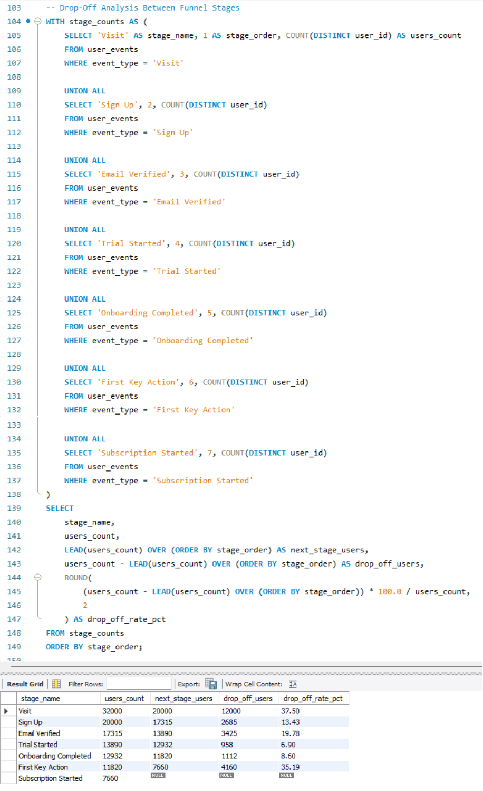

# SaaS Conversion Funnel Analysis (SQL, Power BI, Python)

📊 SQL Analysis | 📈 Power BI Dashboard | 🧠 Funnel & Conversion Insights

---

## Executive Summary
This project analyzes a SaaS user acquisition funnel to identify where users drop off and what drives subscription conversions.

Using a custom-generated synthetic dataset designed to simulate realistic SaaS behavior, the analysis tracks user progression from initial visit to paid subscription and evaluates performance across channels, devices, and regions.

The results show that the largest drop-off occurs at the earliest stage (Visit → Sign Up), while users who complete onboarding are significantly more likely to convert. Additionally, acquisition channels and device types have a measurable impact on outcomes.

Improving early-stage conversion and onboarding experience could meaningfully increase the number of paying users, highlighting clear opportunities for growth.

---

## Dashboard

The Power BI dashboard provides a high-level view of the SaaS conversion funnel, highlighting user progression, drop-offs, and key performance metrics across different segments.

It includes:

- Funnel visualization of user progression across all stages  
- Key KPIs such as Total Users, Total Subscribers, and Conversion Rate  
- Subscriber distribution by acquisition channel, device type, and country  

The dashboard is designed to support quick identification of bottlenecks and enable data-driven decision-making.

---

## Business Problem

SaaS businesses rely heavily on converting users from initial engagement to paid subscription, as this directly impacts revenue growth.

However, it is often unclear where users drop off in the conversion funnel and which factors influence successful conversions. Product and marketing teams need visibility into how users progress through key stages such as sign-up, onboarding, and activation.

This project aims to identify:

- where the largest drop-offs occur in the funnel  
- how efficiently users convert into subscribers  
- which acquisition channels, devices, and regions drive higher conversion rates  

Understanding these patterns enables teams to optimize user experience, improve onboarding, and make better decisions on marketing investment.

---
## Dataset

The dataset was synthetically generated in Python based on a structured prompt designed using a custom GPT within ChatGPT ("Dataset Creator"), with the goal of simulating a realistic SaaS conversion funnel.

Since direct export from the GPT was not possible, a custom Python script was used to generate the data locally. This approach allowed full control over the dataset structure, table relationships, and user behavior logic, ensuring consistency with a real-world funnel scenario.

### Structure

The dataset consists of three relational tables:

**users**
- user_id  
- signup_date  
- country  
- device_type  
- acquisition_channel  
- plan_interest  

**events**
- event_id  
- user_id  
- event_datetime  
- event_type  

Includes both registered users and additional visitors, allowing realistic top-of-funnel analysis where Visit > Sign Up.

**subscriptions**
- subscription_id  
- user_id  
- subscription_start_date  
- plan_tier  
- monthly_revenue  
- billing_cycle  
- is_active  

### Dataset Size
- 20,000 users  
- 100,000+ events  
- ~7,600 subscriptions  

### Data Design & Realism

The dataset simulates realistic SaaS dynamics:

- Sequential funnel stages:
  Visit → Sign Up → Email Verified → Trial Started → Onboarding Completed → First Key Action → Subscription Started  
- Controlled conversion rates between stages  
- Variation across:
  - acquisition channels  
  - device types  
  - countries  
- Inclusion of non-converting users at early stages  
- Realistic time progression between events  

### Notes

- Fully synthetic dataset (no real user data)  
- Designed specifically for analytics and portfolio use  
- The dataset generation script is included in the project files:  
  📄 [generate_saas_dataset.py](python/generate_saas_dataset.py)  
- The dataset design prompt is included in the project files:  
  📄 [dataset_prompt.txt](docs/dataset_prompt.txt)   

---

## Data Model

The Power BI data model is built around the `users` table as the central dimension, connected to both `events` and `subscriptions` via `user_id`.

This structure enables:

- Funnel analysis at event level  
- Segmentation by channel, device, and country  
- Subscription and revenue analysis  

A separate measures table is used to organize key KPI calculations.

---

## Data Dictionary

A detailed data dictionary is available in the project files:

📄 [data_dictionary.xlsx](docs/data_dictionary.xlsx)

---

## Methodology

The project combines Python, SQL, and Power BI.

### Python (Data Generation)
- Generated synthetic dataset based on realistic SaaS funnel behavior  
- Implemented stage transitions, probabilities, and segmentation logic  

### SQL (Analysis)

SQL was used to explore user behavior across the funnel, calculate conversion metrics, and validate data consistency.

Key analyses included:

- **Funnel stage distribution**  
  Measured how many users reach each stage of the funnel using `COUNT(DISTINCT user_id)`

- **Conversion rates between stages (LAG)**  
  Used window functions (`LAG`) to compare each stage with the previous one and calculate step-by-step conversion rates  

  

- **Drop-off analysis between stages (LEAD)**  
  Used window functions (`LEAD`) to identify how many users drop between stages and calculate drop-off rates  

  

- **Conversion by acquisition channel, device, and country**  
  Compared how different segments perform in terms of converting users into subscribers  

- **Revenue analysis by plan and billing cycle**  
  Evaluated how subscription plans and billing frequency impact total revenue  

- **Data quality validation**  
  Ensured logical consistency across tables (e.g. subscription dates occur after signup)

### Power BI (Visualization)

- Built relational data model  
- Created KPI measures (Total Users, Subscribers, Conversion Rate)  
- Designed interactive dashboard  
- Enabled filtering across segments  

---

## Results & Business Recommendations

### Key Findings

- The largest drop-off occurs at the Visit → Sign Up stage  
- Users who pass early stages show strong progression  
- A noticeable drop occurs between product usage and subscription  
- Email campaigns drive the highest number of subscribers  
- Desktop users convert better than mobile users  
- The United States generates the highest subscriber volume  

---

### Business Recommendations

**1. Improve early-stage conversion**
- Simplify signup process  
- Optimize landing page messaging  
- Reduce friction in user entry  

**2. Strengthen onboarding**
- Add guided onboarding flows  
- Highlight product value early  
- Encourage first key action quickly  

**3. Optimize marketing channels**
- Invest more in high-performing channels  
- Re-evaluate low-performing campaigns  

**4. Improve mobile user experience**
- Simplify mobile onboarding  
- Improve usability and performance  

**5. Expand strong markets**
- Scale campaigns in high-performing regions  
- Localize strategy for weaker markets  

---

### Estimated Impact

- A 5% improvement in Visit → Sign Up could add ~1,000 users  
- This could generate ~200–300 additional subscribers  
- Demonstrates strong leverage of early-stage optimization  

---

## Limitations

- Synthetic dataset, not real-world data  
- Revenue is simplified and does not include subscription cancellations or long-term customer value  
- No time-based or cohort analysis  
- External business factors (e.g. pricing changes, campaigns) are not included  
- User behavior is simulated using predefined probabilities  
- The Power BI dashboard is provided as a `.pbix` file only, since the free version does not support online sharing  

---

## Next Steps

- Analyze user behavior over time (cohort analysis)  
- Measure time between funnel steps  
- Improve revenue analysis (include cancellations and long-term value)  
- Segment users based on behavior  
- Test improvements using A/B simulations  

---

## Skills Demonstrated

### Technical
- SQL (joins, aggregations, window functions, CTEs)  
- Power BI (data modeling, DAX, dashboards)  
- Python (data simulation)  

### Analytical
- Funnel analysis  
- Conversion and drop-off analysis  
- Segmentation analysis  

### Business
- Translating data into insights  
- Identifying growth opportunities  
- Linking user behavior to revenue impact  
